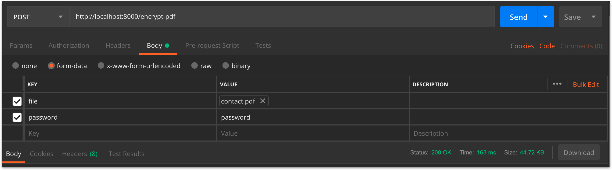

# Encrypt File PDF

[](https://github.com/python/black)

API for encrypt file PDF.




# Install

Make sure your uesed python3 and clone this repository

- Manual
    ```js
    1. cd src
    2. pip install -r requirements.txt
    3. python app.py
    ```
- Docker Compose
    ```js
    docker-compose up -d --build
    ```


# API

Endpoint: `/encrypt-pdf`

Method: `POST`

| Parameter  | Description| 
| :---         |     :---     |
| file   | File for encrypt (.pdf only) | 
| password | your key for encrypt file |